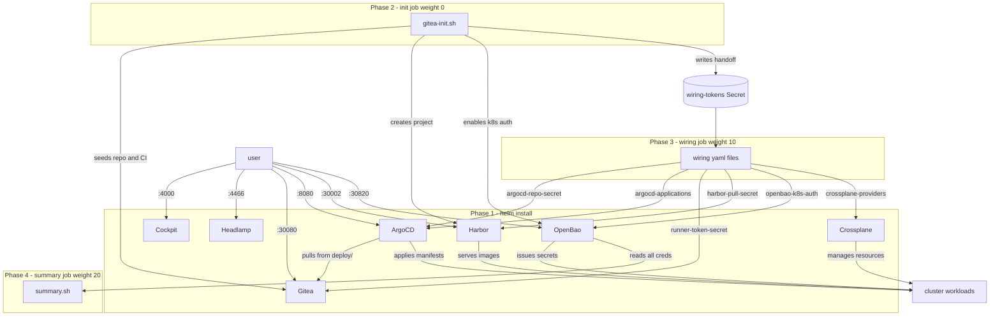

# wiring/

This folder is the entire point of the platform.

The components (Gitea, Harbor, ArgoCD, OpenBao, Crossplane) don't know about each other
out of the box. Wiring is what connects them — the credentials, secrets, and configuration
objects that make them work together as a system.

Every file here is plain Kubernetes YAML. No custom controllers, no operators, no magic.
Just the objects Kubernetes already knows how to handle: Secrets, ConfigMaps, and CRDs.

---

## diagram



---

## how it works

Helm installs the components in Phase 1. Then two jobs run as post-install hooks:

```
Phase 2 — init job (hook weight 0)
  scripts/gitea-init.sh
    → seeds Gitea (demo repo, CI workflow)
    → obtains tokens (runner, ArgoCD, Headlamp)
    → stores all credentials in OpenBao
    → writes clusterfactory-wiring-tokens Secret (handoff to Phase 3)

Phase 3 — wiring job (hook weight 10)
  reads clusterfactory-wiring-tokens
  runs sed on each wiring/*.yaml to substitute $VARIABLES
  kubectl apply -f each file

Phase 4 — summary job (hook weight 20)
  scripts/summary.sh
    → reads credentials from OpenBao
    → prints access summary (URLs, passwords, tokens)
```

The only contract between phases is the `clusterfactory-wiring-tokens` Secret.
Phase 3 does not care how Phase 2 produced those values.

---

## the files

| file | from | to | what it does |
|---|---|---|---|
| `argocd-repo-secret.yaml` | Gitea | ArgoCD | ArgoCD authenticates to Gitea to pull manifests |
| `argocd-applications.yaml` | Gitea | ArgoCD | ArgoCD Application watching `deploy/` in the demo repo |
| `runner-token-secret.yaml` | Gitea | runner | runner registration token so the runner can join Gitea Actions |
| `harbor-pull-secret.yaml` | Harbor | cluster | Docker pull secret so pods can pull images from Harbor |
| `openbao-k8s-auth.yaml` | OpenBao | cluster | Kubernetes auth so pods can authenticate to OpenBao with their SA token |
| `crossplane-providers.yaml` | Crossplane | cluster | Kubernetes provider for in-cluster resource management |

All wiring objects carry these labels so you can query them as a group:

```bash
kubectl get all -A -l clusterfactory/wiring
```

---

## the scripts

| script | runs in | what it does |
|---|---|---|
| `scripts/gitea-init.sh` | init job (Phase 2) | seeds components, generates tokens, stores in OpenBao |
| `scripts/summary.sh` | summary job (Phase 4) | reads OpenBao, prints access summary |

Scripts live here alongside the wiring files because they are the same kind of thing:
plain mechanics that connect components together. The only difference is that wiring files
are declarative (kubectl apply) and scripts are imperative (curl, kubectl create).

Both are visible, readable, and editable. There is no framework between you and the cluster.

---

## adding a connection

1. Create a new YAML file here describing the Kubernetes object (Secret, ConfigMap, CRD)
2. Use `$VARIABLE` placeholders for any runtime values
3. Add the sed substitution + kubectl apply block in `templates/wiring-job.yaml`
4. If the variable comes from a component, generate it in `scripts/gitea-init.sh` and add it to `clusterfactory-wiring-tokens`

That's it.
